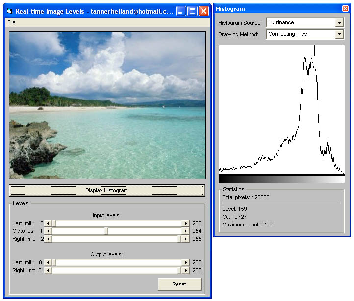



## Real\-time Image Levels \(input/output/midtone\) \- Just Like Photoshop\!

### Description

This is the first of its kind in VB: accurate, real-time image level adjustment. (This will be very familiar to any PhotoShop users among us :) Image Levels provide better control over an image's luminance than strict brightness/contrast methods (since they tend to distribute an image's histogram more equally). Adjusting an image using input/output/midtone levels is mainly used to brighten or darken an image without losing detail at either end of the luminance spectrum. I've included simple histogram drawing code (as the screenshot shows) so that you can see the effects that adjusting input/output/midtone levels has on an image's histogram. The code is well-commented and fast - please post comments and enjoy!
 
### More Info
 

             |
---                |---
**Submitted On**   |2006-11-01 12:20:28
**By**             |[Tanner H](https://github.com/Planet-Source-Code/PSCIndex/blob/master/ByAuthor/tanner-h.md)
**Level**          |Intermediate
**User Rating**    |4.9 (88 globes from 18 users)
**Compatibility**  |VB 6\.0
**Category**       |[Graphics](https://github.com/Planet-Source-Code/PSCIndex/blob/master/ByCategory/graphics__1-46.md)
**World**          |[Visual Basic](https://github.com/Planet-Source-Code/PSCIndex/blob/master/ByWorld/visual-basic.md)
**Archive File**   |[Real\-time\_2028201112006\.zip](https://github.com/Planet-Source-Code/tanner-h-real-time-image-levels-input-output-midtone-just-like-photoshop__1-66955/archive/master.zip)

### API Declarations

DIB sections

